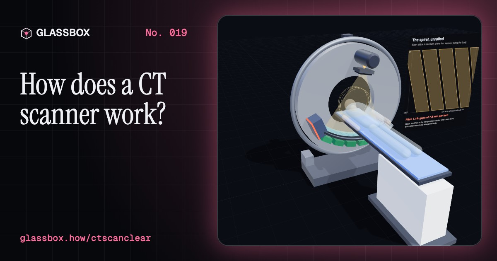
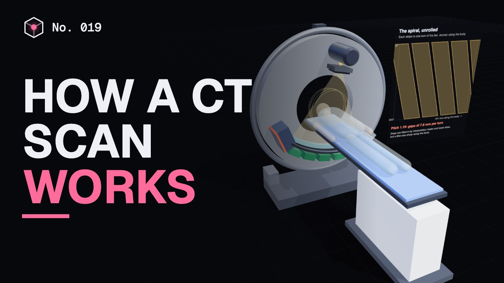
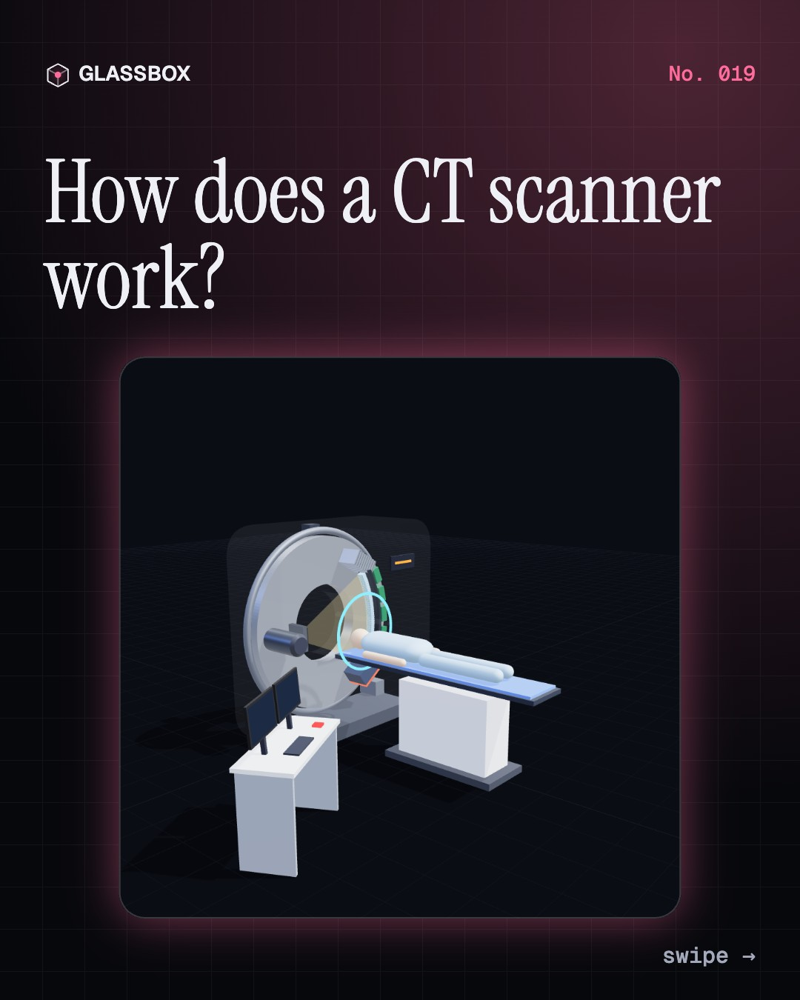
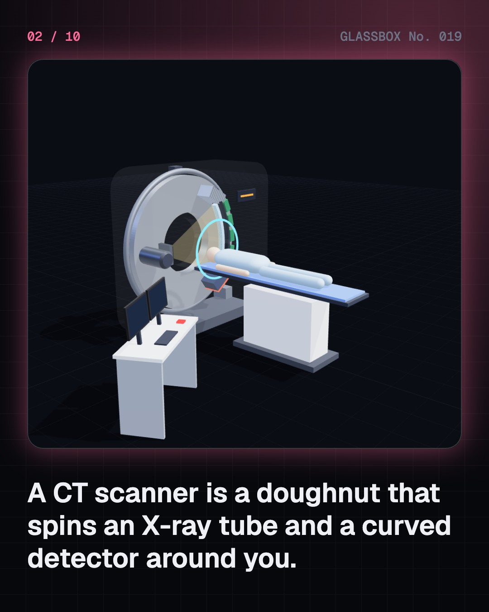
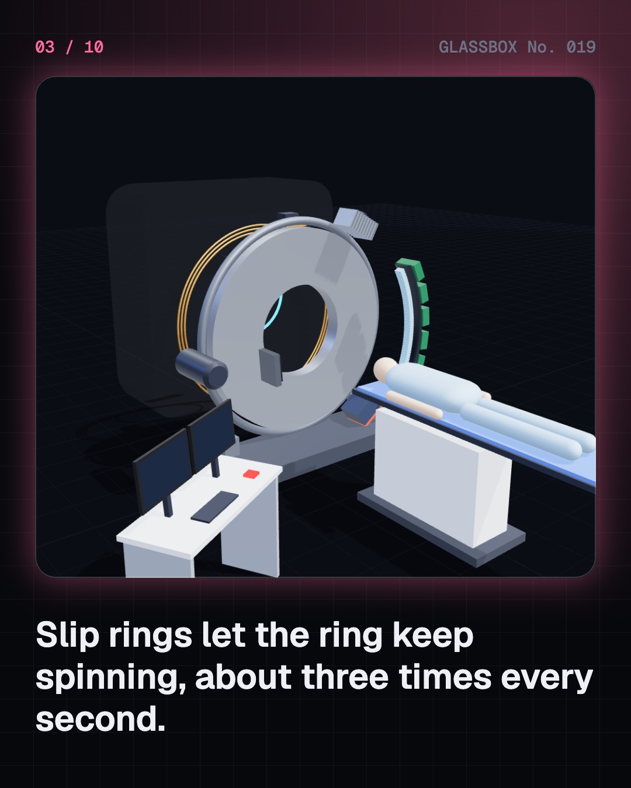
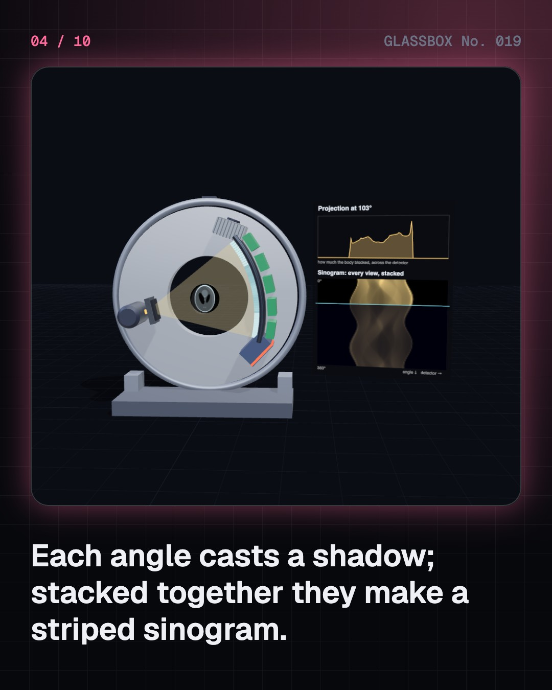

<!-- glassbox:start -->
<!-- Generated from glassbox.json by the Glassbox hub (npm run readme -- ctscanclear). Edit glassbox.json, not this block. -->
<p align="center"><a href="https://glassbox-production-fd52.up.railway.app/e/ctscanclear/"></a></p>

<h1 align="center">CTScanClear</h1>

<p align="center"><b>How does a CT scanner work?</b><br>A CT scanner spins an X-ray tube around you three times a second, takes about a thousand shadows each turn, and a computer turns them into slices of your body. Take one apart in 3D, then rebuild a slice yourself with real maths.</p>

<p align="center"><a href="https://glassbox-production-fd52.up.railway.app/ctscanclear/"><b>▶ Play with it</b></a> &nbsp;·&nbsp; <a href="https://glassbox-production-fd52.up.railway.app/e/ctscanclear/">Read the 60-second explainer</a> &nbsp;·&nbsp; <a href="https://glassbox-production-fd52.up.railway.app/ctscanclear/glassbox/reel.mp4">Watch the 40-second video</a></p>

<p align="center">
  <a href="https://glassbox-production-fd52.up.railway.app/e/ctscanclear/"></a>
  <a href="https://glassbox-production-fd52.up.railway.app/e/ctscanclear/"></a>
  <a href="LICENSE"></a>
  <a href="LICENSE-CONTENT.md"></a>
  <a href="#privacy"></a>
</p>

## In 60 seconds

1. **A spinning ring of X-rays.** Inside the doughnut-shaped gantry, a heavy disc carries an X-ray tube and a curved detector with 64 or more rows of sensors. Slip rings let it spin continuously, once every 0.25 to 0.5 seconds, while the table slides you through.
2. **Hundreds of shadows, one slice.** Each detector measures how much X-ray got through along one line. One snapshot is a projection: a 1D shadow of the slice. About 1,000 projections per turn, stacked by angle, make a sinogram. In a helical scan the table moves as the tube spins, so the beam traces a spiral.
3. **Rebuilding the picture.** Smear every shadow back across the image and add them up: back-projection. On its own it gives a blurry, streaky slice. Sharpen each shadow first with a ramp (Ram-Lak) filter and the true slice appears. The maths dates from Johann Radon in 1917.
4. **Every pixel is a number.** CT measures attenuation and reports it in Hounsfield units: water is 0, air is −1000, fat about −100, bone +400 to over +1000. A window of level and width decides which numbers become grey, so the same scan can show brain, lung or bone.
5. **Dose and speed.** A head CT gives about 2 mSv, a chest CT about 7 and an abdomen and pelvis CT about 8 to 10, against about 2.4 mSv a year from nature and 0.02 to 0.1 for a chest X-ray. Lower dose means more noise, so scanners modulate the tube current and use iterative reconstruction. A whole-body trauma scan takes seconds.
6. **Modern tricks.** Dual-energy CT uses two X-ray energies to tell materials apart, like uric acid and calcium kidney stones. Cardiac CT times the scan to the ECG. Photon-counting CT, first cleared in 2021, counts every X-ray and measures its energy.

## Words worth knowing

| Term | Meaning |
|---|---|
| **Gantry** | The doughnut-shaped part of a CT scanner that holds the spinning X-ray tube and detector. |
| **Projection** | The shadow profile of a slice from one angle: how much X-ray each detector received. |
| **Sinogram** | All the projections of a slice stacked by angle; each point in the body traces a sine-shaped line in it. |
| **Pitch** | Table travel per rotation divided by the beam width. At pitch 1 the spiral's turns just touch. |
| **Filtered back-projection** | Rebuilding a slice by sharpening each projection with a ramp filter and smearing it back across the image. |
| **Hounsfield unit** | CT's scale of attenuation: HU = 1000 × (μ − μwater) ÷ μwater, so water is 0 and air is −1000. |
| **Window level and width** | The range of Hounsfield units a viewer maps from black to white. |
| **Millisievert** | A unit of radiation dose. The world average from natural sources is about 2.4 mSv a year. |
| **Dual-energy CT** | Scanning at two X-ray energies to tell materials apart by how their attenuation changes with energy. |

## A short history

**A century from a mathematician's formula to scanners that see inside you in seconds.**

- **1895** · X-rays are discovered (Wilhelm Röntgen, Würzburg)
- **1917** · The maths of shadows (Johann Radon, Vienna)
- **1963** · Cormack publishes (Allan Cormack, Tufts University, Medford)
- **1971** · The first scan of a patient (Godfrey Hounsfield and James Ambrose, Atkinson Morley's Hospital, Wimbledon, London)
- **1971** · A faster way to rebuild (G. N. Ramachandran and A. V. Lakshminarayanan, Indian Institute of Science, Bangalore)
- **1974** · The first whole-body scanner (Robert Ledley, Georgetown University, Washington DC)
- **1978** · India's first CT scanner (All India Institute of Medical Sciences, New Delhi)
- **1979** · A Nobel Prize for two outsiders (Allan Cormack and Godfrey Hounsfield, Stockholm)

The full story, with 25 moments, charts, people and 32 sources: [glassbox.how/e/ctscanclear/history](https://glassbox-production-fd52.up.railway.app/e/ctscanclear/history/). The data lives in [`history.json`](history.json).

## Video and slides

Made with the Glassbox studio from this box's storyboard (`window.glassbox.director`). Free to reuse under CC BY 4.0.

<a href="https://glassbox-production-fd52.up.railway.app/ctscanclear/glassbox/video.mp4"></a>

<p><a href="glassbox/slide-1.jpg"></a> <a href="glassbox/slide-2.jpg"></a> <a href="glassbox/slide-3.jpg"></a> <a href="glassbox/slide-4.jpg"></a></p>

| File | What | Size |
|---|---|---|
| [`glassbox/reel.mp4`](https://glassbox-production-fd52.up.railway.app/ctscanclear/glassbox/reel.mp4) | Reel / Short, with captions and soundtrack | 1080×1920 |
| [`glassbox/video.mp4`](https://glassbox-production-fd52.up.railway.app/ctscanclear/glassbox/video.mp4) | YouTube video, with captions and soundtrack | 1920×1080 |
| `glassbox/slide-1…10.jpg` | Instagram carousel | 1080×1350 |
| `glassbox/thumb.jpg` | YouTube thumbnail | 1280×720 |
| `glassbox/cover.jpg` | Share card and repo social preview | 1200×630 |
| [`glassbox/history-reel.mp4`](https://glassbox-production-fd52.up.railway.app/ctscanclear/glassbox/history-reel.mp4) | “History in 10 moments” Reel / Short | 1080×1920 |
| `glassbox/history-slide-*.jpg` | History carousel | 1080×1350 |
| `glassbox/post.json` | Post copy and schedule used by the publish kit | |

## Privacy

This box has no accounts and no ads, and it ships its own fonts and libraries. When you run it yourself it sends nothing anywhere. On glassbox.how, the site's `/bar.js` also loads Glassbox's analytics: **Google Analytics** to count visits (it asks first in the EU, UK and Switzerland, and stays off when your browser sends Global Privacy Control or Do Not Track) and **ClickTrust** to detect bots.

It remembers a few things **in your own browser only**, and never sends them anywhere:

| Browser storage key | What it holds |
|---|---|
| `ctscanclear.v1` | Which chapters you have opened, your best quiz scores, and sound on or off. |

Exactly what each one sees is at [glassbox.how/privacy](https://glassbox-production-fd52.up.railway.app/privacy/).

## Licences

- **Code:** [MIT](LICENSE). Use it, change it, ship it.
- **Explanations, text, images and videos** (`glassbox.json`, `glassbox/`): [CC BY 4.0](LICENSE-CONTENT.md). Credit “Glassbox, glassbox.how/e/ctscanclear”.
- **Third-party parts** keep their own licences: [three.js](https://threejs.org) (MIT), [Geist, Instrument Serif](https://openfontlicense.org) (SIL OFL 1.1).
- The Glassbox name and logo aren't covered by either licence. See the [terms](https://glassbox-production-fd52.up.railway.app/terms/).

Found a mistake? [Open an issue](https://github.com/bdeeps/ctscanclear/issues). Corrections happen in public.
<!-- glassbox:end -->

## Run it

It's plain HTML, CSS and JavaScript. No build step and no dependencies. Run locally, it contacts no other website.

```bash
python3 -m http.server 8000
```

Three.js and the fonts ship in `vendor/` and `fonts/`, so it also works offline.

Then open http://localhost:8000.

## How it's built

| File | What |
|---|---|
| `index.html`, `css/app.css` | The page and its styles |
| `js/app.js`, `js/stage.js`, `js/ui.js`, `js/kit.js` | The shared Glassbox 3D engine: chapters, 3D stage, controls, quiz, video director |
| `js/ct.js` | Shared models and maths: the CT gantry, table, patient and console; the Shepp–Logan phantom with exact line integrals; the Ram-Lak filter and back-projection; Hounsfield-unit slices; NIST attenuation data for dual energy |
| `js/chapters/*.js` | One file per chapter: the 3D model, controls, text, key terms, quiz and video scenes |
| `glassbox.json` | Title, question, explainer beats, key terms, browser storage and credits shown on glassbox.how |
| `reel` in each chapter | The storyboard the Glassbox studio records into short videos |
| `glassbox/` | The published video, slides, thumbnail and post copy |
| `fonts/`, `vendor/three/` | Self-hosted Geist and Instrument Serif (SIL OFL 1.1) and three.js (MIT) |
